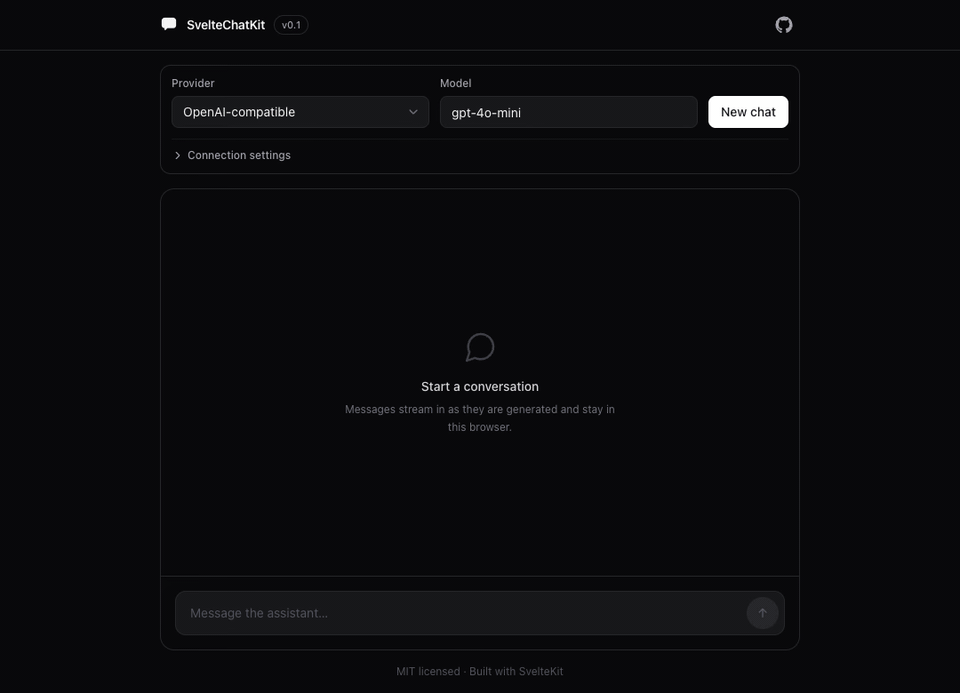
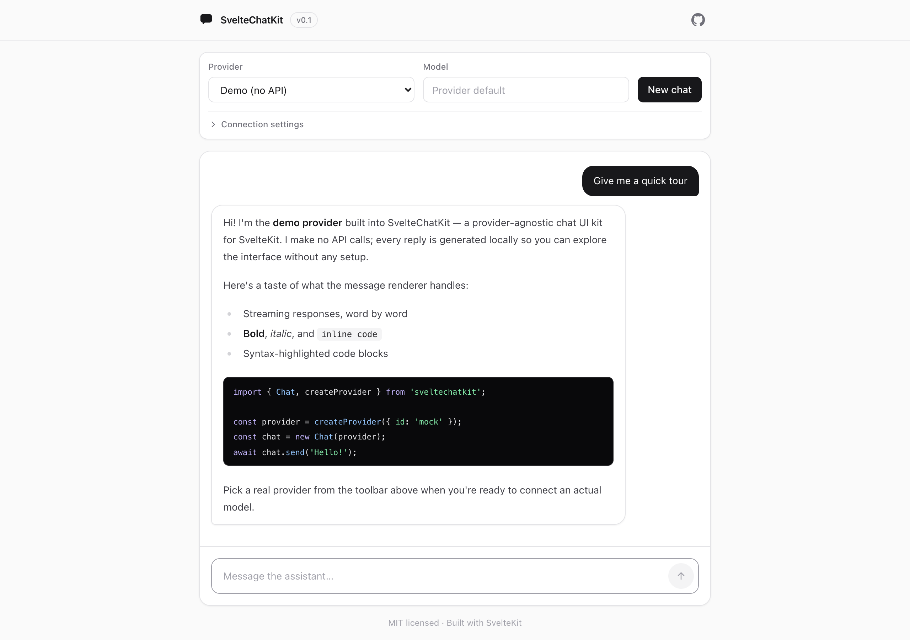
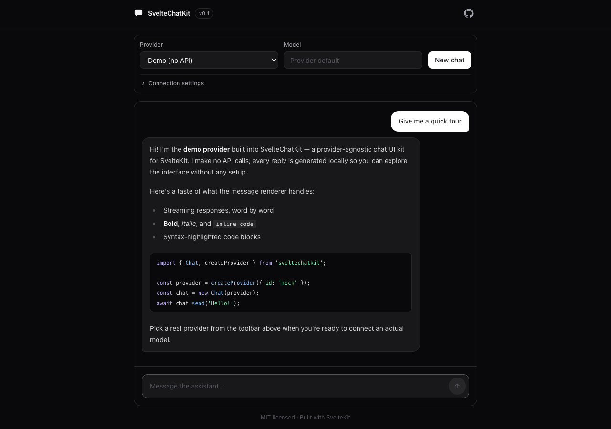

<div align="center">

# SvelteChatKit

**AI chat UI for SvelteKit that works with any backend.**

[](LICENSE)
[](https://svelte.dev)
[](https://www.typescriptlang.org)
[](CONTRIBUTING.md)



</div>

One chat UI, any LLM. Swap between OpenAI, Ollama, Dify, n8n or your own API by changing a config object. The streaming, markdown, history and UI all stay the same. Built with Svelte 5 and SvelteKit 2, fully typed, MIT.

## What you get

- Token-by-token streaming, with a stop button that actually aborts the request
- One small `ChatProvider` interface. Your own backend takes about 20 lines
- Chat history that survives reloads (localStorage)
- Markdown with highlighted code blocks, sanitized
- File attachments: pick or paste images and files, sent to providers that support them
- Auto-scroll that follows the stream but leaves you alone when you scroll up
- Errors show up in the UI instead of dying in the console
- Dark mode, works on mobile, TypeScript strict
- Runs with zero config, the built-in demo provider needs no API key

## Providers

| `id`     | Works with                                                  | Needs                                     |
| -------- | ----------------------------------------------------------- | ----------------------------------------- |
| `openai` | OpenAI, OpenRouter, Groq, LM Studio, vLLM, llama.cpp, etc.  | `baseUrl`, `apiKey`, `model`              |
| `ollama` | Local models via Ollama                                     | `baseUrl` (+ `OLLAMA_ORIGINS` in browser) |
| `dify`   | Dify chat apps                                              | `baseUrl`, `apiKey`                       |
| `n8n`    | n8n workflows behind a Chat Trigger                         | `baseUrl` = chat webhook URL              |
| `custom` | Your own endpoint or proxy (SSE, streamed text, plain JSON) | `baseUrl`                                 |
| `mock`   | Demo mode, no network                                       | nothing                                   |

## Try it

```bash
git clone https://github.com/kristofers322/SvelteChatKit.git
cd SvelteChatKit
npm install
npm run dev
```

Runs on the mock provider out of the box. Copy `.env.example` to `.env` when you want to talk to a real backend. Needs Node 20+.

## Use it in your app

```bash
npm install sveltechatkit
```

```svelte
<script lang="ts">
	import { Chat, ChatWindow, createProvider } from 'sveltechatkit';
	import 'sveltechatkit/styles.css';

	const provider = createProvider({
		id: 'openai',
		baseUrl: 'https://api.openai.com/v1',
		apiKey: 'sk-...',
		model: 'gpt-4o-mini'
	});

	const chat = new Chat(provider, { storageKey: 'my-app:chat' });
</script>

<ChatWindow {chat} />
```

The components are styled with Tailwind (v3 and v4 both work). Tailwind doesn't scan `node_modules` by default, so without this step everything renders unstyled:

**Tailwind v4**, in your main CSS file:

```css
@import 'tailwindcss';
@plugin '@tailwindcss/typography';
@source '../node_modules/sveltechatkit/dist';
```

**Tailwind v3**, in `tailwind.config.js`:

```js
import typography from '@tailwindcss/typography';

export default {
	content: ['./src/**/*.{html,js,svelte,ts}', './node_modules/sveltechatkit/dist/**/*.svelte'],
	plugins: [typography]
};
```

If you'd rather build your own UI, skip `ChatWindow`. The `Chat` class gives you reactive `messages`, `status`, `error` and `busy`, plus `send()`, `stop()`, `clear()` and `setProvider()`.

### Attachments

The composer has a paperclip button, and you can paste images straight into it. Files are capped at 2MB each and 4 per message (both configurable via `ChatInput` props); history persists to localStorage, so keep attachments small. What each provider does with them:

- `openai` sends images as vision content parts (needs a vision model)
- `ollama` sends images to multimodal models like llava
- `dify` uploads files first, then references them in the chat call
- `n8n` switches to multipart form data, like the official n8n chat widget
- `custom` passes `{ name, mimeType, size, dataUrl }` through in the JSON body
- `mock` describes what you attached

Programmatic use: `chat.send('what is this?', [await fileToAttachment(file)])`.

Two things to know. Stateless providers (`openai`, `ollama`, `custom`) re-send earlier attachments with every following message, because the model needs them for context; keep files small or start a new chat when you're done with one. And persisted history lives in localStorage (about 5MB), so if a conversation outgrows it the kit keeps the text and drops attachment data from the saved copy; those attachments show as chips after a reload.

## Your own backend

Implement one interface, register it, done:

```ts
import { ensureOk, registerProvider, sseStream } from 'sveltechatkit';
import type { ChatMessage, ChatProvider, ProviderConfig, SendMessageOptions } from 'sveltechatkit';

class MyBackendProvider implements ChatProvider {
	readonly id = 'my-backend';
	readonly label = 'My Backend';

	constructor(private config: ProviderConfig) {}

	async *sendMessage(messages: ChatMessage[], options?: SendMessageOptions) {
		const response = await fetch(`${this.config.baseUrl}/chat`, {
			method: 'POST',
			headers: { 'Content-Type': 'application/json', ...this.config.headers },
			body: JSON.stringify({ messages: messages.map(({ role, content }) => ({ role, content })) }),
			signal: options?.signal
		});
		await ensureOk(response, this.id);
		for await (const data of sseStream(response)) {
			if (data === '[DONE]') return;
			yield JSON.parse(data).content as string;
		}
	}
}

registerProvider('my-backend', (config) => new MyBackendProvider(config));
```

There's a full walkthrough with a working Anthropic provider in [docs/adding-a-provider.md](docs/adding-a-provider.md).

## Config

The demo reads `PUBLIC_*` vars from `.env`. Every variable is listed in [.env.example](.env.example) and they're all optional. In your own app it's better to pass a `ProviderConfig` object directly (like the snippet above), since that works with any bundler.

One thing to know: `PUBLIC_*` vars end up in the client bundle, so anyone can read them. Fine for local dev. In production keep keys on your server and point the `custom` provider at a small proxy route.

## Screenshots

| Light                                                  | Dark                                                 |
| ------------------------------------------------------ | ---------------------------------------------------- |
|  |  |

## How it fits together

```
┌──────────────────────────────────────────────────────┐
│                     Components                        │
│   ChatWindow ─ MessageList ─ MessageBubble            │
│   ChatInput ─ Markdown ─ TypingIndicator              │
└──────────────────────────┬───────────────────────────┘
                           │ props
                  ┌────────▼─────────┐
                  │   Chat (runes)   │  messages · status · error
                  │ send/stop/clear  │  persistence · abort
                  └────────┬─────────┘
                           │ sendMessage(history, { signal, model })
               ┌───────────▼────────────┐
               │ ChatProvider interface │  AsyncGenerator<string>
               └───────────┬────────────┘
     ┌─────────┬─────────┬─────────┼─────────┬────────────┐
     ▼         ▼         ▼         ▼         ▼            ▼
  OpenAI-   Ollama     Dify      n8n      Custom        Mock
  compat.                               endpoint    (no network)
     │         │         │         │         │
     ▼         ▼         ▼         ▼         ▼
    SSE      NDJSON     SSE     NDJSON   SSE / text
                (upstream chat APIs)
```

## Roadmap

- [ ] Auth support
- [ ] Vector DB / RAG helpers
- [ ] Plugin system (message middleware, custom renderers)
- [ ] More themes
- [ ] Precompiled CSS so you can use the kit without Tailwind
- [x] File attachments
- [ ] Tool-calling UI
- [x] npm package

## Contributing

PRs welcome. New providers are the most useful thing you can add. See [CONTRIBUTING.md](CONTRIBUTING.md).

## License

[MIT](LICENSE). Use it, fork it, ship it.
